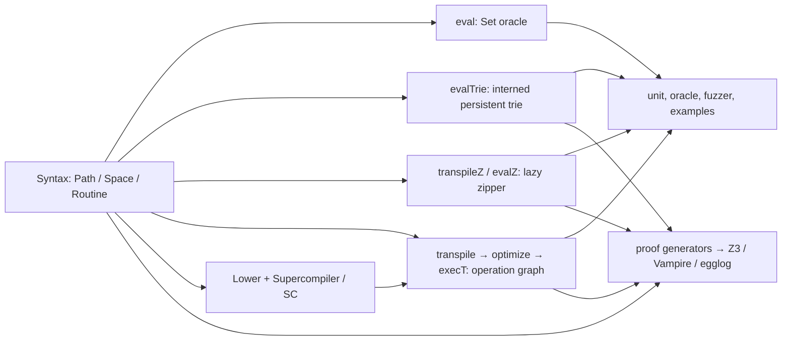

# Zippy Atlas

Zippy implements finite path-set algebra. A `Space` program is evaluated by a simple set oracle, a persistent trie, a compiled operation graph, or a lazy zipper; tests compare those representations. The valued track is deliberately separate.

## Production components

| Component | Responsibility | Uses / feeds |
| --- | --- | --- |
| `src/main/scala/MORKL.scala` | AST, contexts, `SpaceValue` oracle, routines, graph IR/transpiler/interpreters, source lowering, conservative compiler, DSL. | Foundation for every backend; graph backend feeds `exec`/`execT`; `Supercompiler` adds process specialization. |
| `TrieSpace.scala` | Interned `PathItem` ids; immutable `IntMap` trie with set, prefix, product, tail/head, closure, and ordered-range operations; `evalTrie`, trie graph executors. | Native denotation and the eager implementation used by graph and zipper checks. |
| `TrieIntMapOps.scala` | Patricia-style child-map union/intersection/difference/restriction with identity/empty metadata. | Called by `TrieSpace`; structural reuse is a runtime invariant. |
| `ZipperSpace.scala` | `SpaceZipper` virtual nodes, memoization, focus/context edits, demand-driven child movement, virtual algebra, range/frontier closures, `transpileZ`/`evalZ`/`execZ`. | Reuses trie leaves and path interning; must materialize to the trie denotation. |
| `Supercompiler.scala` | Binder-safe substitution/canonicalization, embedding/MSG whistle, process-tree driving and residual routines. | Complements `MORKL.Supercompiler` source passes; residuals run through normal evaluators/backends. |
| `ResultSpaceSize.scala` | Symbolic lower/upper cardinality expressions, per-operator bounds, audit reporting. | Analyses source/normalized programs; optional Z3 refinement tightens Boolean correlations. |
| `Z3ResultSpaceSize.scala` | Emits and runs bounded Z3 optimization/query problems. | Refines `ResultSpaceSize` estimates; absence of Z3 remains a safe no-refinement case. |
| `ResultPathLength.scala` | Symbolic lower/upper path-length expressions and binder-aware propagation through every path/space constructor. | Uses Z3 Venn-region feasibility, cardinality bounds, and structural relations to remove impossible length regions without weakening the compositional fallback. |
| `SpatialType.scala` | Product abstract domain over symbolic path patterns, per-length cardinalities, total size, path lengths, piecewise control, and fiber degrees. | Replaces output-side `otypes`; refines and is checked against both scalar Z3 analyses. |
| `Fuzzer.scala` | Dependent distributions, symbolic locations, path-space generator, reproducible corpus writer. | Produces differential inputs and corpora consumed by test fuzzers. |
| `ProofArtifacts.scala` | Generates SMT-LIB/TPTP/egg proof artifacts and manifests. | Source of truth for `tools/proof_pipeline.py`; writes generated proof directories. |
| `valued/.../ValuedTrieSpace.scala` | Optional path-to-payload trie, lattice merge, direct valued evaluator, concrete cursor. | Sidecar only: no production dependency; payload laws require stronger hypotheses. |

## Test, generation, and measurement components

| Area | Files | Role |
| --- | --- | --- |
| Core semantics | `MORKL.scala` (tests), `TrieSpaceTest.scala` | DSL examples; exhaustive/random reference–trie–graph agreement; epsilon, closure, recursion, lowering, and zipper regressions. |
| Zipper oracle | `ZipperDenotationOracleTest.scala`, `ZipperFuzzerTest.scala` | Exhaustive small denotations, virtual cursor behavior, generated programs, backend verifier, corpus/timing analysis. |
| Domain references | `ReferenceExamplesTest.scala` | Independent Datalog, Life, puzzle, NOAA, and n-queens checks. |
| Supercompilation | `SupercompilerProcessTest.scala` | Binding, matching/generalization, termination, residual-size/soundness checks. |
| Size analysis | `ResultSpaceSizeTest.scala`, `ResultSpaceSizeAuditRunner.scala` | Bound soundness/refinement and audit report generation. |
| Path-length analysis | `ResultPathLengthTest.scala`, `ResultPathLengthAuditRunner.scala`, `RESULT_PATH_LENGTH_LAWS.md`, `RESULT_PATH_LENGTH_AUDIT.md` | Full-constructor propagation, correlated Z3 refinement, laws, scaling, and paired random-corpus soundness. |
| Spatial analysis | `SpatialTypeTest.scala`, `SpatialTypeLatticeTest.scala`, `CornerstoneSpatialTypeTest.scala`, `SpatialTypeAuditRunner.scala`, `SPATIAL_TYPES.md`, `SPATIAL_TYPE_LAWS.md`, `CORNERSTONE_ABSTRACT_INTERPRETATIONS.md` | Complete semantic interval lattice, reduced-product and semantic-contract laws, group-sensitive/pointwise iteration, finite relational counts, always-abstract annotated routine boundaries, tightened cornerstone/fixpoint reports, restriction dependencies, piecewise control, affine arithmetic, Game of Life, degree summaries, FOL obligations, and random projection checks. |
| Proof emitters | `IllustrativeEggArtifacts.scala`, `CornerstoneProofArtifacts.scala`, `OpenProgramProofArtifacts.scala`, `ZipperEgg*.scala` | Generate root egg models, cornerstone/open-program certificates, and executable zipper witnesses. |
| Benchmarks | `TrieBenchmarks.scala`, `TrieAlgebraAsymptoticBenchmark.scala`, `ZipperAlgebraBenchmarks.scala`, `ZipperLargeBenchmarks.scala`, `IndependentProductBenchmark.scala` | Write checked-in performance reports; correctness-check before timing. |
| Valued sidecar | `valued/.../ValuedTrieSpaceTest.scala` | Validates payload lattice and concrete cursor semantics independently. |

The remaining `src/test/scala/ZipperEgg*Program.scala` files are focused generated/hand-maintained egg witnesses; `ZipperEggDescentPrelude.scala` supplies their shared operational vocabulary. `ProofArtifacts`, the test emitters, and `tools/proof_pipeline.py` own generated proof content; do not hand-edit generated artifacts.

## Data and documentation

- `src/test/resources/noaa_slice.txt` is the committed reproducible NOAA fallback. Other datasets are optional and tests use deterministic fallbacks.
- `proofs/`, `zipper-egg-tests/`, and `valued/proofs/` contain generated solver artifacts; `terminating/` contains termination obligations.
- `docs/ALGEBRA.md` is the language paper; the other `docs/` reports record current benchmarks, proof status, size analysis, fallback inventory, and zipper audit.

## Execution rules

1. Define semantics in the reference evaluator first; preserve agreement with trie, graph, and zipper paths.
2. Keep trie and zipper work structural: avoid `encodedPaths`, `toSpaceValue`, or full materialization on selective paths.
3. Treat graph calls and unsupported zipper recursion as explicit boundaries, never silent fallback performance claims.
4. Regenerate reports/artifacts through their owner and run the matching oracle/proof gate.
